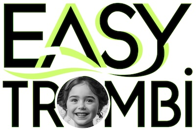
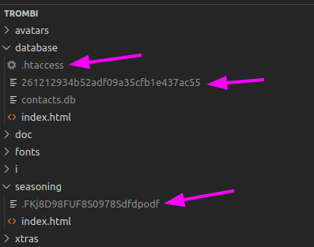
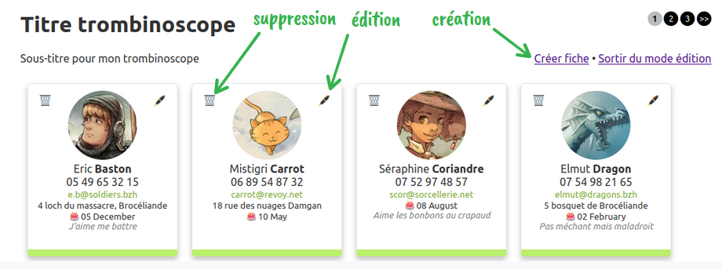
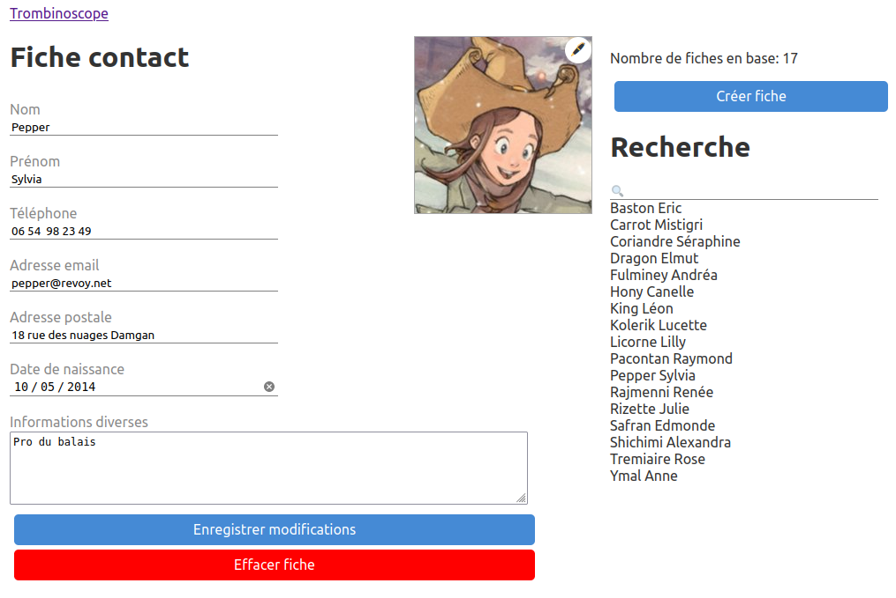
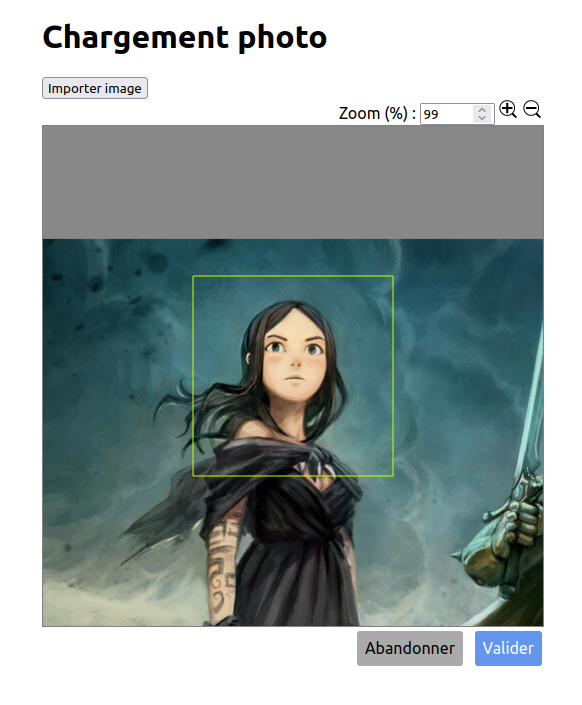

# Trombinoscope

Ce trombinoscope a pour objectif d'être simple à utiliser et à installer sur n'importe quel hébergement PHP avec du SQLite.

Il est né d'un besoin ponctuel et ne prétend pas à l'excellence, mais  peut servir de base facilement modifiable pour des petites structures  (asso, collectif...).

Il inclut un mode d'édition un peu automatisé des champs, et une page de création d'avatar avec import ou copier/collé direct d'image.



# Installation

- Placer le répertoire à l'emplacement souhaité sur votre hébergement.
- copier le fichier ***config-default.php*** sous le nom de ***config.php***.
- Editer ***config.php*** pour changer notamment les champs voulus dans la base de données ainsi que le dossier de localisation. La table de travail du trombinoscope sera créée à la première consultation du trombinoscope via un navigateur web.
- ⚠️ Veiller à ce que les répertoires ***database***, ***seasoning*** et ***avatars*** soient bien créés et avec des droits en écriture.

Pour réinitialiser le processus il suffit d'effacer le fichier SQLite, par défaut ***database/contacts.db***

Le mot de passe n'est pas défini. À la première connexion à la page ***login.php***, vous choisirez celui que vous voudrez. Un fichier sera créé dans le dossier ***database*** dont le nom sera fonction du mot de passe que vous aurez choisi.

En cas d'oubli du mot de passe, il faudra supprimer le fichier précédemment créé, ainsi que le fichier ***.htaccess*** et le fichier de *salage* (fichier caché dans le répertoire ***seasoning*** dont le nom est dans le fichier ***config.cpp***, variable KEY_SALT).

Emplacement des fichiers à supprimer (les votres n'auront pas les mêmes noms)




# Démo

Un trombinoscope d'exemple fait avec les splendides illustrations et l'aimable autorisation de [David Revoy](https://www.davidrevoy.com/) est disponible ici : https://jcfrog.com/easy-trombi

Il devrait ressembler à ça :


# Edition

Une page de login est disponible : ***login.php***

Le mot de passe par défaut n'est déterminé qu'à la première connexion.

Une option dans le fichier de config permet d'afficher ou non un lien vers cette page de login en bas de page principale.

Pour sortir du mode édition il faut ajouter le paramètre *?editpw=stop*. Un lien permet de le faire d'un clic.



## Ajouter / modifier

L'ajout de fiche se fait en mode édition seulement.

La page de création/édition dispose d'un outil de recherche sur les index indiqués comme ***Mandatory*** dans le fichier de config. 




### Avatar

Le signe 🖊️ en haut à droite de l'avatar donne accés à une page d'import/collage d'image permettant de rapidement créer un avatar à la bonne dimension et recadré.




# Personalisation

## config.php

### Champs éditables

Variable ***$fields*** : champs de la base, un tableau permet de définir les champs qu'on veut avoir pour chaque fiche. Les champs à utiliser pour les recherches de fiches doivent être indiqués comme ***mandatory***. Au moins un champ doit être considéré comme mandatory.

Exemple

```php
    "name" => array ( "input" => "text", "label" => "Nom", "mandatory" => true),
```

Pour chaque champ on donne le type d'input (date, text, textarea, email), et un label.

La base sera mise à jour en cas d'ajout de nouveaux champs.
En cas de suppression de champs, une confirmation sera demandée.

Si l'on veut ajouter d'autres options au champ, il suffit de renseigner un tableau ***other***.

En dehors des nom et prénom, l'ordre d'affichage est déterminé par l'ordre des champs dans ***$fields***.

Par défaut le label n'est pas affiché, pour qu'il le soit, il faut ajouter pour le champs correpondant un ***display-label***.

Exemple:
```php
    "phone" =>  array( "input" => "text", "label" => "Téléphone", "display-label" => true),
```

### Logo

Pour personnaliser un logo peut être ajouté devant le titre du trombinoscope grâce à la variable *$siteLogo*. Il suffit d'enlever la ligne si on ne veut pas de logo.

```php
/* Site identity */
$siteTitle = "Titre trombinoscope";
$siteSubtitle = "Sous-titre pour mon trombinoscope";
$siteLogo = "workshop/logo.png"; // path to the logo image. Remove it if you don't want to display a logo
```

### Autres

Vous trouverez quelques paramètres suplémentaires comme les titres et sous titre pour le trombinoscope, ou encore le nombre de fiches par pages.

## styles.css

L'allure des cartes de visites affichées dépend de ***styles.css***. 

Vous pourrez notamment changer la hauteur des cartes (class *.tb-card*) selon vos besoins, et personnaliser chaque champs.

## style-custom.css

Ce fichier contient les styles pour les champs affichés. A chaque champs défini dans le tableau ***$fields*** dans ***config.php*** est associé un style qu'il suffira de modifier. Au champ ayant la clé "xxxx" correspond le style "tbi-xxxx".

Exemple: le champ nom *"name"* est affiché selon la règle css *.tbi-name*.

De la même façon on pourra modifier le style du label du champs s'il est affiché: "tbi-label-xxxx"

# license

GPL 3

# Remerciements

Merci à [Jerry Wham](https://toot.aquilenet.fr/@jerry_wham) pour des modifs et conseils concernant la sécurité du code.

Merci à [David Revoy](https://www.davidrevoy.com/) pour ses illustrations utilisées dans la démo et pour la doc.